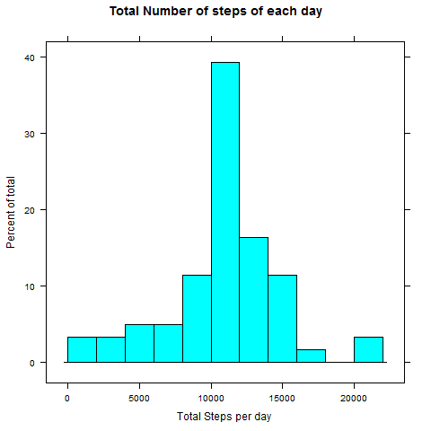
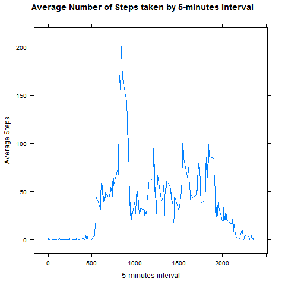
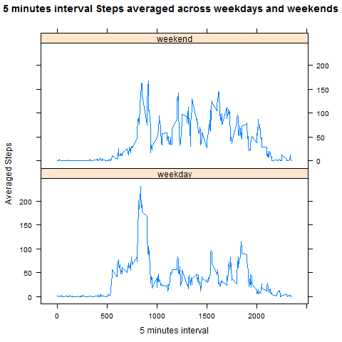

------

## Introduction

In this document I'm going to explain the analisys with a dataset obtained from a 
personal activity monitoring device from a person that wants to measure themselves 
and improve their health. 

[The URL to the data](https://d396qusza40orc.cloudfront.net/repdata%2Fdata%2Factivity.zip)

**Reading data file**

I've used *dplyr* library to group and summarise subset of observations and 
*Lattice* to draw the plots.

```{r  message=FALSE}
library(dplyr)
library(lattice)
invisible(Sys.setlocale("LC_TIME", "C")) #Trick to get weekdays() in English

data <- read.csv("activity.csv", sep = ",", 
                  col.names = c("steps", "date", "interval"),
                  colClasses = c("integer", "Date", "integer"))
```


The variables included in this dataset are:  
- Steps: Number of steps taking in a 5-minute interval (missing values are coded as NA)  
- Date: The date on which the measurement was taken in YYYY-MM-DD format  
- Interval: Identifier for the 5-minute interval in which measurement was taken  

The dataset is stored in a comma-separated-value (CSV) file and there are a total 
of 17,568 observations in this dataset.

-------

### Question 1: What is mean total number of steps taken per day?

*Filter* the nan-values in the steps variable.

```{r}
noNAS <- filter(data, !is.na(steps))
```

1.1. Make a histogram of the total number of steps taken each day

```{r}
  data %>%
  group_by(date) %>%
  summarise(totalSteps = sum(steps)) %>% 
  with(histogram(totalSteps , breaks = 14, layout = c(1, 1), 
                 xlab ="Total Steps per day", ylab = "Percent of total",
                 main = "Total Number of steps of each day"))

```
 

1.2. Calculate and report the mean and median total number of steps taken per day  

```{r}  
  noNAS %>%
  group_by(date) %>%
  summarise(totalSteps = sum(steps))%>% 
  ungroup() %>%
  summarise(meanSteps = mean(totalSteps),
            medianSteps = median(totalSteps))
```

------

## Question2: What is the average daily activity pattern?

2.1. Make a time series plot (i.e. type = "l") of the 5-minute interval 
(x-axis) and the average number of steps taken, averaged across all days (y-axis)

```{r} 
  noNAS %>%
  group_by(interval) %>%
  summarise(meanSteps = mean(steps)) %>% 
  with(xyplot(meanSteps ~ interval, type = "l",
              main = "Average Number of Steps taken by 5-minutes interval", 
              xlab = "5-minutes interval", 
              ylab = "Average Steps"))
      
```



2.2. Which 5-minute interval, on average across all the days in the dataset, 
contains the maximum number of steps? 
 
```{r} 
  noNAS %>%
  group_by(interval) %>%
  mutate(meanSteps = mean(steps)) %>%
  ungroup() %>%
  top_n(meanSteps, n = 1) 
```

------

## Question 3: Imputing missing values

3.1. There are only missing values in the steps variable.

```{r}
  nrow(filter(data, is.na(steps)))
``` 

3.2. Create a dataframe *df_media_interval* with the mean for all intervals to late fill missing values.

```{r}
  noNAS %>%
  group_by(interval) %>%
  summarise(meanSteps = mean(steps)) -> df_media_interval
```

3.3 Create a new dataset that is equal to the original dataset but with the
missing data filled in. 

```{r}  
  for(i in 1:nrow(data)){
    if (is.na(data[i,]$steps)){
      inter_val <- data[i,]$interval
      data[i,]$steps <- filter(df_media_interval, interval ==  inter_val)$meanSteps
    }
  }
```

Check nan values.
```{r}
nrow(filter(data, is.na(steps)))
```

3.4 No Missing Values in the data set

  a) Make a histogram of the total number of steps taken each day
```{r}  
  data %>%
  group_by(date) %>%
  summarise(totalSteps = sum(steps)) %>% 
  with(histogram(totalSteps , breaks = 14, layout = c(1, 1), 
                 xlab ="Total Steps per day", ylab = "Percent of total",
                 main = "Total Number of steps of each day"))

```
 

  b) Calculate and report the mean and median total number of steps taken per day  

```{r}
  data %>%
  group_by(date) %>%
  summarise(totalSteps = sum(steps))%>% 
  ungroup() %>%
  summarise(meanSteps = mean(totalSteps),
            medianSteps = median(totalSteps))
```

c) Do these values differ from the estimates from the first part of the assignment?
The media just vary 0.55steps and the median vary a little bit more in 3 steps from
the original.

d) What is the impact of imputing missing data on the estimates of the total
daily number of steps?
The total daily number of steps increases as a result of added values, specially around # the mean.

------

## Question 4: Are there differences in activity patterns between weekdays and weekends?

4.1 Create a new factor variable in the dataset with two levels – “weekday” and “weekend” 
indicating whether a given date is a weekday or weekend day.

```{r}
  data %>%
  mutate(day_type = as.factor(ifelse(weekdays(as.Date(date)) %in% c("Saturday", "Sunday"), "weekend", "weekday"))) -> data
```

4.2 Make a panel plot containing a time series plot (i.e. type = "l") of the 5-minute interval (x-axis) and the average number of # steps taken, averaged across all weekday days or weekend days (y-axis). See the README file in the GitHub repository to see an
example of what this plot should look like using simulated data.

```{r}
  data %>%
  group_by(interval, day_type) %>%
  summarise(averaged_steps = mean(steps)) %>%
  xyplot(averaged_steps ~ interval | day_type, data = ., type = "l", layout = c(1, 2),
         xlab = "5 minutes interval", ylab = "Averaged Steps",
         main = "5 minutes interval Steps averaged across weekdays and weekends")
```
 
